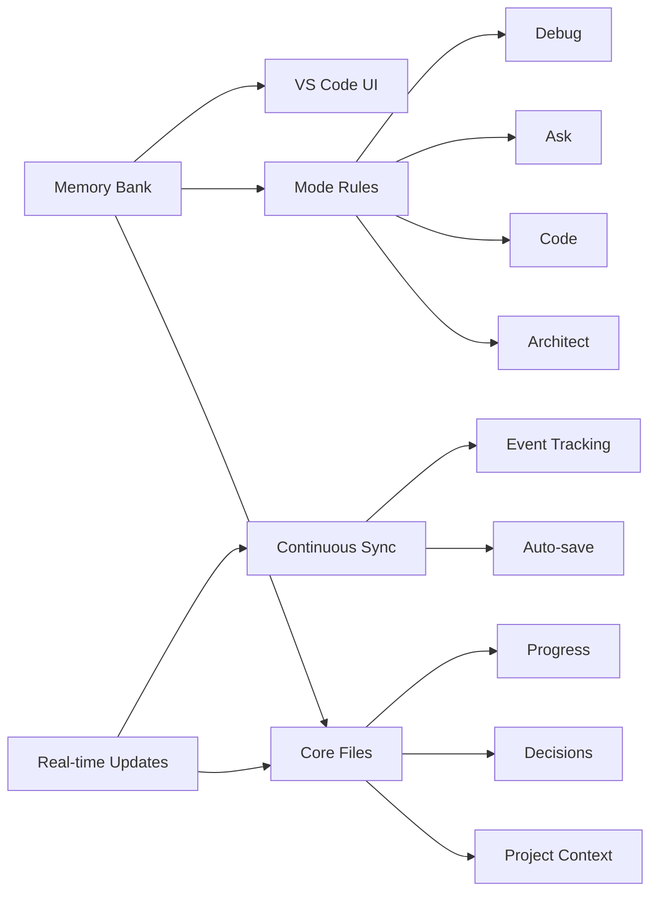
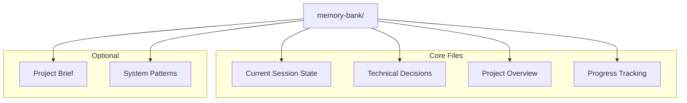
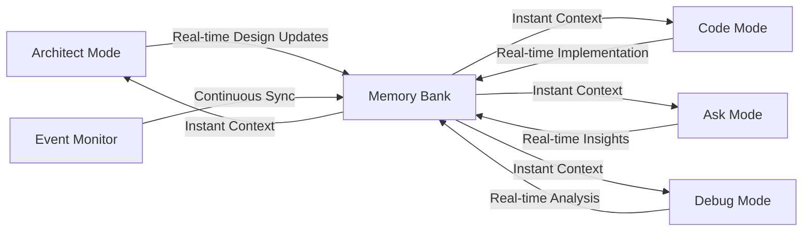
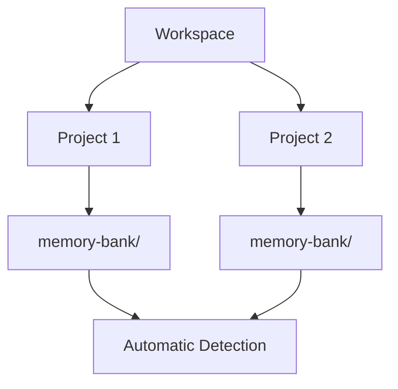
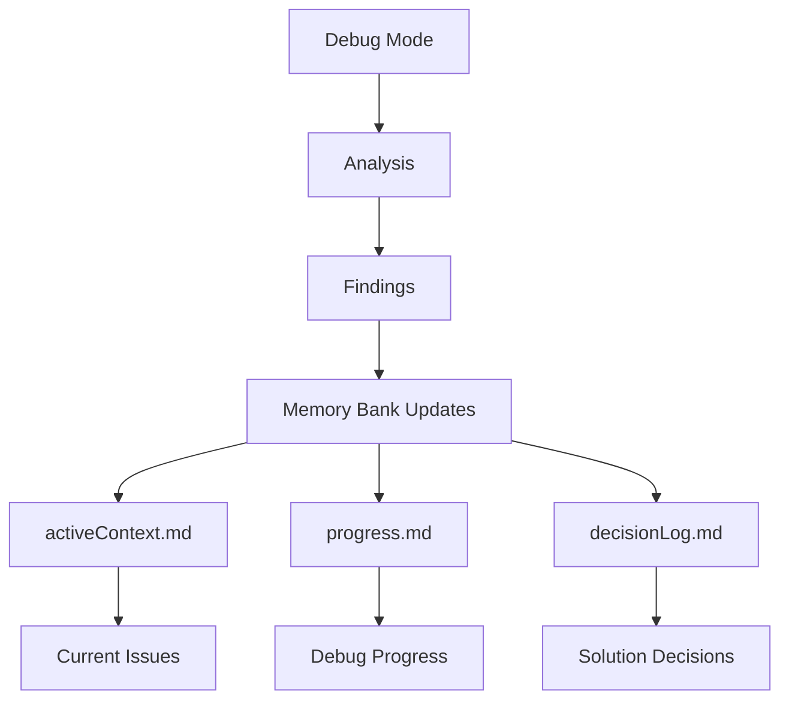

<div align="center">
    
### 🚨Major [Update](https://github.com/GreatScottyMac/RooFlow) Coming Soon!🚨

<br>

# 🧠 Roo Code Memory Bank

**Persistent Project Context for AI-Assisted Development**

[](https://github.com/RooVetGit/Roo-Code)
[](https://github.com/GreatScottyMac/roo-code-memory-bank)

</div>

## 🎯 Overview

Roo Code Memory Bank solves a critical challenge in AI-assisted development: **maintaining context across sessions**. By providing a structured memory system integrated with VS Code, it ensures your AI assistant maintains a deep understanding of your project across sessions.

### Key Components



- 🧠 **Memory Bank**: Persistent storage for project knowledge
- 📋 **Mode Rules**: YAML-based behavior configuration
- 🔧 **VS Code Integration**: Seamless development experience
- ⚡ **Real-time Updates**: Continuous context synchronization

## 🚀 Quick Start

### 1. Configure Custom Instructions

#### a. Copy Rule and Mode Files
Download and copy these files to your project's **root** directory:
| Mode | Rule File | Purpose |
|------|-----------|----------|
| Code | [`.clinerules-code`](https://github.com/GreatScottyMac/roo-code-memory-bank/blob/main/.clinerules-code) | Implementation and coding tasks |
| Architect | [`.clinerules-architect`](https://github.com/GreatScottyMac/roo-code-memory-bank/blob/main/.clinerules-architect) | System design and architecture |
| Ask | [`.clinerules-ask`](https://github.com/GreatScottyMac/roo-code-memory-bank/blob/main/.clinerules-ask) | Information and assistance |
| Debug | [`.clinerules-debug`](https://github.com/GreatScottyMac/roo-code-memory-bank/blob/main/.clinerules-debug) | Troubleshooting and problem-solving |

#### b. Configure VS Code Settings
> ⚠️ **Important**: Leave the "Custom Instructions" text boxes **empty** in VS Code settings (Roo Code Prompts section)

<details>
<summary>📷 View Settings Screenshot</summary>


</details>

### 2. Initialize Memory Bank

1. Switch to **Architect** or **Code** mode in Roo Code chat
2. Send a message (e.g., "hello")
3. Roo will automatically:
   - 🔍 Scan for `memory-bank/` directory
   - 📁 Create it if missing (with your approval)
   - 📝 Initialize core files
   - 🚦 Provide next steps

<details>
<summary>💡 Pro Tip: Project Brief</summary>

Create a `projectBrief.md` in your project root **before** initialization to give Roo immediate project context.
</details>

### File Organization

```
project-root/
├── .clinerules-architect
├── .clinerules-code
├── .clinerules-ask
├── .clinerules-debug
├── memory-bank/
│   ├── activeContext.md
│   ├── productContext.md
│   ├── progress.md
│   └── decisionLog.md
└── projectBrief.md
```

## 📚 Memory Bank Structure



<details>
<summary>📖 View File Descriptions</summary>

| File | Purpose |
|------|----------|
| `activeContext.md` | Tracks current goals, decisions, and session state |
| `decisionLog.md` | Records architectural choices and their rationale |
| `productContext.md` | Maintains high-level project context and knowledge |
| `progress.md` | Documents completed work and upcoming tasks |
| `projectBrief.md` | Contains initial project requirements (optional) |
| `systemPatterns.md` | Documents recurring patterns and standards |

</details>

## ✨ Features

### 🧠 Persistent Context
- Remembers project details across sessions
- Maintains consistent understanding of your codebase
- Tracks decisions and their rationale

### 🔄 Smart Workflows

- Mode-based operation for specialized tasks
- Automatic context switching
- Project-specific customization via rules

### 📊 Knowledge Management
- Structured documentation with clear purposes
- Technical decision tracking with rationale
- Automated progress monitoring
- Cross-referenced project knowledge

## 💡 Pro Tips

### Multiple Projects

Roo automatically handles multiple Memory Banks in your workspace!

### Debug Mode
Roo Code Memory Bank includes a powerful Debug mode for systematic troubleshooting and problem-solving. This mode operates with surgical precision, focusing on root cause analysis and evidence-based verification.

#### Key Capabilities
- 🔍 **Non-destructive Investigation**: Read-only access ensures system integrity during analysis
- 📊 **Diagnostic Tools**: Access to logging, tracing, and system analysis tools
- 🔬 **Systematic Analysis**: Methodical problem investigation and isolation
- 🎯 **Root Cause Identification**: Traces error propagation through all system layers
- ✅ **Evidence-based Verification**: Validates findings through multiple checkpoints

#### Real-time Update Triggers
Debug mode actively monitors and updates Memory Bank files based on:
- 🐛 Bug discoveries and error patterns
- 💾 Memory leaks and resource issues
- 🔄 Race conditions and deadlocks
- 📈 Performance bottlenecks
- 📝 Log analysis and trace outputs

#### Memory Bank Integration


Switch to Debug mode when you need to:
- Investigate system behavior
- Analyze failure patterns
- Isolate root causes
- Verify fixes
- Document debugging insights

### Session Management
- ⚡ **Real-time Updates**: Memory Bank automatically stays synchronized with your work
- 💾 **Manual Updates**: Use "UMB" or "update memory bank" as a fallback when:
  - Ending a session unexpectedly
  - Halting mid-task
  - Recovering from connection issues
  - Forcing a full synchronization

## 📖 Documentation

- [Developer Deep Dive](https://github.com/GreatScottyMac/roo-code-memory-bank/blob/main/developer-primer.md)
- [Update Log](https://github.com/GreatScottyMac/roo-code-memory-bank/blob/main/updates.md)

---

<div align="center">

**[View on GitHub](https://github.com/GreatScottyMac/roo-code-memory-bank) • [Report Issues](https://github.com/GreatScottyMac/roo-code-memory-bank/issues) • [Get Roo Code](https://github.com/RooVetGit/Roo-Code)**

</div>

## License

Apache 2.0 © 2025 [GreatScottyMac](LICENSE)
